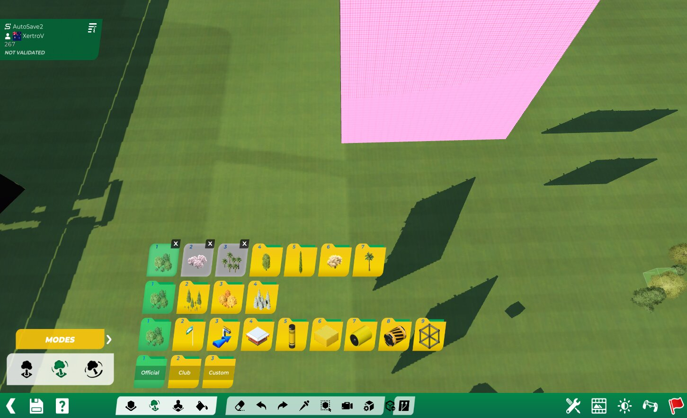

# TM Agent

**An AI agent that works inside Trackmania.**

`tm-agent` is an [Openplanet](https://openplanet.dev/) plugin with a native chat UI, provider-aware conversation history, and direct access to Trackmania tools through [`mcp-tm`](https://github.com/clankercode/tm-mcptm). Ask it to inspect the current map, reason about editor state, call tools, and continue from structured results without leaving the game.

<p align="center">
  
</p>

> The current screenshot shows the in-game shell. A representative tool-running capture is planned as the UI stabilizes.

| | |
|---|---|
| **Platform** | Trackmania (current) + Openplanet |
| **Providers** | MiniMax/Anthropic-compatible Messages API; OpenAI Chat Completions and Responses |
| **Tool bridge** | `mcp-tm` plus `MLHook` |
| **License** | Dual [Unlicense](./UNLICENSE) **or** [CC0 1.0](./CC0-1.0) — public domain / no attribution required |
| **Status** | Active development (`info.toml` `0.1.0`) |
| **Releasing** | [RELEASE.md](./RELEASE.md) · [CHANGELOG.md](./CHANGELOG.md) |

## What it does

- **In-game agent loop** — submit a task, watch provider turns and tool calls, and cancel or start a clean conversation safely.
- **Trackmania-aware tools** — consumes the schemas and results exported by `mcp-tm`, including nested MCP success/error semantics.
- **Provider-native history** — Anthropic `tool_use` / `tool_result` blocks and OpenAI Responses encrypted reasoning continuity.
- **Operational visibility** — status, step timing, token usage, context pressure, per-tool latency, errors, and compaction controls.
- **Resilient async lifecycle** — generation-based cancellation prevents stale provider/tool continuations from mutating a new chat.
- **Developer driver** — optional DEV-only file IPC for deterministic UI seeding and smoke automation.

## Requirements

1. Trackmania with [Openplanet](https://openplanet.dev/) installed.
2. Openplanet dependencies:
   - `mcp-tm` — local Trackmania tool bridge
   - `ai-api` — provider transport and shared interfaces
   - `MLHook`
3. An API key for the selected provider.

API keys are stored through Openplanet password settings. Never commit keys or include them in screenshots/logs.

## Install for development

Clone the three local plugins as siblings so `build.sh` can stage dependencies:

```text
my-plugins/
├── tm-agent/
├── tm-aiapi/
└── tm-mcptm/
```

Then:

```bash
git clone https://github.com/clankercode/tm-agent.git
cd tm-agent
./build.sh dev
```

`./build.sh dev` stages local dependencies, installs the folder plugin under `~/OpenplanetNext/Plugins`, runs Openplanet LSP when installed, and asks `tm-remote-build` to reload the plugins when available. Install `openplanet-lsp` before release validation; a missing executable only skips the development-time static check with a warning.

Open **Openplanet → Settings → TM Agent**, select a provider, enter its API key and model, then open **Plugins → TM Agent**.

## Development commands

```bash
./build.sh dev            # stage DEV build and reload
./build.sh unittest       # stage UNITTEST build and run the in-plugin suite
./build.sh release-check  # stage release-like build without DEV/UNITTEST
./build.sh release        # build tm-agent-<version>.op

./driver.py ping
./driver.py state
./driver.py seed          # DEV build only: seed a representative conversation
```

Static check:

```bash
openplanet-lsp check --plugins-dir "$HOME/OpenplanetNext/Plugins" \
  --plugins-dir .. --plugin-files-search-path src .
```

## Architecture

```text
TM Agent UI / AgentLoop
        │
        ├── LlmHistory ── provider-native messages + context accounting
        │
        ├── ai-api ───── MiniMax / OpenAI HTTP transports
        │
        └── mcp-tm ───── Trackmania tool schemas, dispatch, and results
                              │
                         Trackmania + MLHook
```

The agent keeps a generic local transcript, converts it for the active provider, executes returned tool calls asynchronously, stores structured results, and schedules the next provider turn. A monotonically increasing run generation invalidates stale async continuations after cancel, disable, or New Conversation.

## Release

See [RELEASE.md](./RELEASE.md). Releases require a release-like live Openplanet compile, fresh in-plugin tests, static checks, and an integrity-tested `.op` archive. Do not invent or silently bump the version.

## License

Use this project under either [The Unlicense](./UNLICENSE) or [CC0 1.0 Universal](./CC0-1.0), at your option. No attribution is required. See [LICENSE](./LICENSE) for the short dual-license notice.
